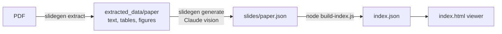
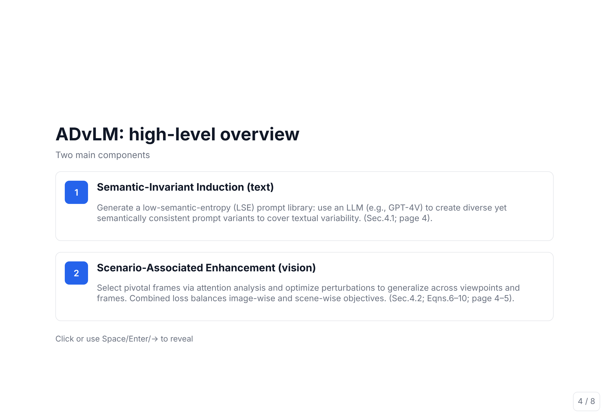

<div align="center">

# slidegen

**Turn a research-paper PDF into a step-by-step slide deck with a vision-language model.**

[](https://github.com/amanyagami/AI-Presentation_using_VLM/actions/workflows/ci.yml)
[](LICENSE)
[](pyproject.toml)
[](https://docs.astral.sh/uv/)





<sub>The bundled viewer rendering this repo's own <code>slides/slide1.json</code> (Chromium screenshot).</sub>

</div>

## Quick start

Requires Python 3.10+, [uv](https://docs.astral.sh/uv/) and Node 18+ (index build and viewer tests).

```bash
uv sync --extra vlm                       # core + anthropic client
uv run slidegen extract raw_pdfs/2505.14984v1.pdf --no-ocr
uv run slidegen generate extracted_data/2505.14984v1 --dry-run   # inspect payload, no API call
export ANTHROPIC_API_KEY=sk-ant-...
uv run slidegen generate extracted_data/2505.14984v1             # writes slides/2505.14984v1.json
uv run slidegen build-index                                      # writes index.json
python -m http.server                                            # open http://localhost:8000/
```

| Install | Adds | When you need it |
|---|---|---|
| `uv sync` | pymupdf, pdfplumber, pillow, pydantic, dev tools | extraction, schema, tests |
| `--extra vlm` | anthropic | `slidegen generate` |
| `--extra ocr` | paddleocr, paddlepaddle (large) | removing text from cropped figures |

## Pipeline

| Stage | Command | Reads | Writes |
|---|---|---|---|
| Extract | `slidegen extract <pdf or dir>` | PDF | `extracted_data/<paper>/output.json`, `images/*.png` |
| Generate | `slidegen generate <extraction dir>` | the above | `slides/<paper>.json` |
| Index | `slidegen build-index` (runs `node build-index.js`) | `slides/*.json` | `index.json` |
| View | `index.html` | `index.json` | none |

- **Extract** combines PyMuPDF (figure regions), pdfplumber (text and tables) and, optionally, PaddleOCR. `python extract_images.py` still works as a wrapper.
- **Generate** sends page text, tables and base64 figures (downscaled to 1568 px) to the Messages API and constrains the reply to the JSON Schema with structured outputs. Output is validated with pydantic; on failure the error goes back to the model, up to 2 retries. Default model `claude-sonnet-5-5` (`--model` or `SLIDEGEN_MODEL`). It exits with a clear error if `ANTHROPIC_API_KEY` is unset; `--dry-run` needs no key.
- **Index** treats `slides/*.json` as the single source of truth. Files are a single Slide or a deck `{"slides": [...]}`. By default slides are inlined; `--lazy` emits `url` entries that the viewer fetches on demand (single-slide files only).

## Schema

Exported to [`schema/slide.schema.json`](schema/slide.schema.json) (`uv run slidegen export-schema`).

| Object | Fields |
|---|---|
| Deck | `slides[]` (unique ids) |
| Slide | `id`, `title`, `subtitle`, `steps[]` (at least one) |
| Step | `number`, `heading`, `body_markdown`, `image?` |
| Image | `src`, `alt` |

`body_markdown` supports `**bold**`, `_italic_`, `[links](https://...)` and paragraphs. The viewer only loads `http`/`https` image URLs (relative paths resolve against the page).

## Deploy (Netlify / Vercel)

The viewer is static. `netlify.toml` and `vercel.json` both run `node build-index.js` and publish the repository root.

| File | Needed on the site |
|---|---|
| `index.html`, `index.json` | yes (`index.json` is generated) |
| `slides/*.json` | yes |
| `extracted_data/<paper>/images/*.png` | yes, if slides reference figures |
| `raw_pdfs/`, `src/`, tests | no |

To publish only the needed files, use build command `node build-index.js --dist dist` and publish directory `dist`.

## Development

```bash
uv run --frozen ruff format src/ tests/
uv run --frozen ruff check src/ tests/
uv run --frozen pytest        # offline; uses a fake Anthropic client
node --test                   # build-index tests
pre-commit install            # ruff-check --fix, ruff-format, uv-lock
```

CI (`.github/workflows/ci.yml`) runs the same checks. `requirements.legacy.freeze.txt` is the old non-installable `pip freeze`, kept for reference.

**Extraction speed** (OCR off, one container, `raw_pdfs/2505.18961v2.pdf`, 27 pages): 6.2 to 6.3 s, about 4.3 pages/s (a cold first run took 8.2 s). Profiling shows roughly 85-90% of the time is pdfplumber's table/line parsing; the PyMuPDF figure stage is about 2 s of a profiled 16.6 s. With PaddleOCR enabled it will be slower; that was not measured.

## Limitations

- Figure and caption detection are geometry heuristics; expect misses on unusual layouts.
- Without the `ocr` extra, text inside cropped figures is not whited out.
- `generate` has been exercised only against a fake client in tests, not the live API.
- Credential check looks only at `ANTHROPIC_API_KEY` / `ANTHROPIC_AUTH_TOKEN`.
- At most 20 figures per request by default (`--max-images`); the model sees page text but not rendered pages.
- Lazy mode cannot split deck files; their slides are always inlined.

---

# Original notes

(Pre-`slidegen` documentation; install steps there are superseded by the section above.)

## PDF Figure Extractor

Extracts figures, tables, and text from PDF files using PyMuPDF, pdfplumber, and PaddleOCR.

---

## Setup

```bash
conda activate <your_env_name>
pip install -r requirements.txt
```

---

## Hardcoded Paths to Update

Open `extract_images.py` and update the following:

| Variable | Line | Description |
|---|---|---|
| `OUTPUT_BASE_DIR` | `OUTPUT_BASE_DIR = Path("extracted_data")` | Root folder where all extracted output (JSON + images) is saved |

---

## Input: Where to Put Your PDFs

Place your PDF files in any local folder, then pass the path as an argument when running the script.

**Recommended structure:**
```
project/
├── extract_images.py
├── requirements.txt
├── input_pdfs/          ← put your PDFs here
│   ├── paper1.pdf
│   └── paper2.pdf
└── extracted_data/      ← output is auto-created here
```

---

## Run

**Single PDF:**
```bash
python extract_images.py input_pdfs/paper1.pdf
```

**Entire folder of PDFs:**
```bash
python extract_images.py input_pdfs/
```

**With optional parameters:**
```bash
python extract_images.py input_pdfs/paper1.pdf [proximity] [min_area] [caption_scan]
# Example:
python extract_images.py input_pdfs/paper1.pdf 20 2000 30
```

| Parameter | Default | Description |
|---|---|---|
| `proximity` | `20` | Max distance (pts) between elements to be grouped into one figure |
| `min_area` | `2000` | Minimum bounding box area (pts²) to be kept as a figure |
| `caption_scan` | `30` | How far below a figure (pts) to scan for a caption |

---

## Output

For each PDF, a folder is created under `extracted_data/`:

```
extracted_data/
└── paper1/
    ├── output.json          ← structured text, tables, and image paths per page
    └── images/
        └── page1_figure0000.png
```

`output.json` structure:
```json
{
  "1": {
    "text": "...",
    "tables": [[ ["col1", "col2"], ["val1", "val2"] ]],
    "images": [{ "path": "...", "bbox": {...}, "is_chart": false, "text_only": false }]
  }
}
```
